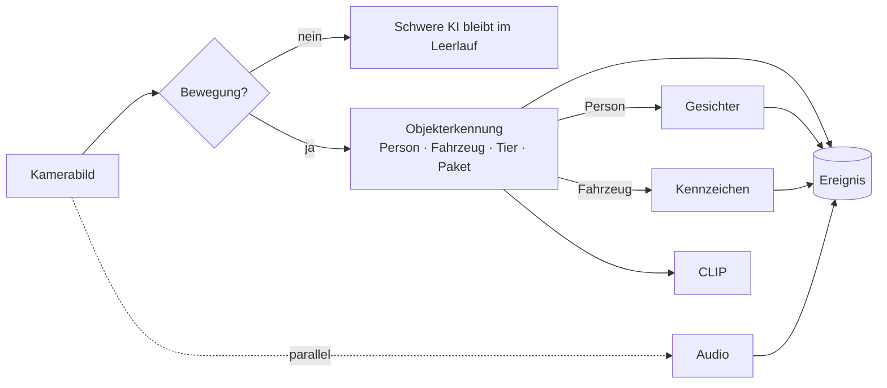

# Erkennung & KI

Erkennung ist, wie camera.ui versteht, was in deinem Video passiert: Bewegung, Personen und Fahrzeuge, Gesichter, Kennzeichen und Geräusche. Sie läuft auf deiner eigenen Hardware, und die Ergebnisse werden zu Ereignissen, die du durchsuchen, über die du benachrichtigt werden und nach denen du suchen kannst.

## Wie Erkennung funktioniert

Erkennung ist gestuft, damit sie effizient bleibt:

1. **Bewegung** läuft durchgehend und günstig. Sie bemerkt nur, dass sich etwas geändert hat.
2. Wenn Bewegung auslöst, wacht die schwerere **KI** auf. Sie führt Objekterkennung aus (Personen, Fahrzeuge, Tiere, Pakete) und schaut dann genauer auf das Gefundene: Gesichter bei den erkannten Personen, Kennzeichen bei den Fahrzeugen und einen semantischen Fingerabdruck für die Suche. Audio wird parallel analysiert.

Diese „Kaskade" bedeutet, dass die anspruchsvolle KI nur läuft, wenn es etwas zu sehen gibt, und jeder Schritt nur auf den Objekten, für die er gilt, was CPU- und GPU-Last niedrig hält.

## Was du erkennen kannst

- **[Bewegung](/de/detection/motion)** — Bewegung im Bild.
- **[Objekte](/de/detection/ai-backends)** — Personen, Fahrzeuge, Tiere und Pakete.
- **[Gesichter](/de/detection/faces)** — bekannte Personen erkennen und unbekannte gruppieren.
- **[Kennzeichen](/de/detection/license-plates)** — Kennzeichen lesen.
- **[Audio](/de/detection/audio)** — Geräusche wie Glasbruch, Alarme oder Hundebellen.
- **[Semantische Suche](/de/detection/semantic-search)** — Momente finden, indem du sie in Worten beschreibst.
- **[KI-Beschreibungen](/de/detection/genai-descriptions)** — eine schriftliche Zusammenfassung des Geschehens.

## Plugins erledigen die Arbeit

Erkennung wird von [Plugins](/de/plugins/) bereitgestellt, die du pro Kamera aktivierst: eine **Bewegungs-Engine** und ein **KI-Backend**, das zu deiner Hardware passt. Du wählst und justierst sie in den [Einstellungen](/de/cameras/settings) einer Kamera. Siehe [Sensoren einrichten](/de/sensors/setup), um sie zu aktivieren.

Jede Erkennung wird Teil eines **Ereignisses**. Siehe [Events & Erkennungen](/de/detection/events-and-detections) für deren Aufbau und [Aufnahmen (NVR)](/de/recording/) zum Durchsehen.
