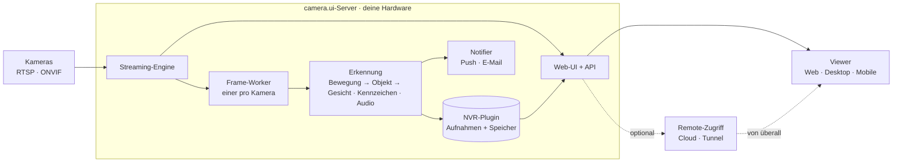

# Wie es funktioniert

camera.ui ist **server-zentral**: Ein einzelner Server, der auf deiner Hardware läuft, erledigt die gesamte Arbeit. Er verbindet sich mit deinen Kameras, streamt und nimmt Video auf, führt die Erkennung aus und liefert die Oberfläche aus. Der Browser und die Mobile-Apps sind **Viewer** dieses Servers. Die Desktop-App kann ebenfalls Viewer sein oder selbst den Server betreiben.

Du musst die Interna nicht verstehen, um camera.ui zu nutzen, aber ein kurzes mentales Modell macht den Rest dieser Doku verständlicher.

## Ein in sich geschlossener Server

Der camera.ui-Server bringt alles mit, was er zum Laufen braucht: die Weboberfläche, eine eingebaute **Streaming-Engine** (unser eigener go2rtc-Build) für Live-Video und eine eigene **Video-Verarbeitung** zum Dekodieren und Aufnehmen. Deine Einstellungen, Kameras, Benutzer und Ereignisse liegen in einer kleinen **lokalen Datenbank** auf derselben Maschine.

Nichts verlässt dein Netzwerk, solange du nicht den [Remote-Zugriff](/de/remote/) aktivierst. Es gibt keine externe Datenbank, und für den Betrieb eines Servers ist kein Cloud-Account nötig.

## Das große Ganze

## Von der Kamera zur Benachrichtigung

Das passiert hinter einer einzelnen Erkennung:

1. **Streaming.** Die Streaming-Engine verbindet sich mit jeder Kamera und wandelt deren Feed in browserfreundliches Live-Video um (WebRTC und MSE). Streams werden „warm" gehalten, damit Live-Ansicht und Snapshots sofort laden.
2. **Analyse pro Kamera.** Jede Kamera bekommt ihren eigenen **Frame-Worker**, einen dedizierten Hintergrundprozess, der das Video dekodiert und die Erkennung ausführt. Da jede Kamera für sich läuft, beeinträchtigt ein Problem bei einer niemals die anderen.
3. **Gestufte Erkennung.** Zuerst läuft die günstige Bewegungserkennung. Erst wenn sie Bewegung sieht, weckt sie die schwerere KI: Objekterkennung, dann Gesichter, Kennzeichen, Klassifizierung und semantische (CLIP-)Analyse. Audio wird parallel analysiert. Diese „Kaskade" hält CPU- und GPU-Last niedrig.[^detect]
4. **Ereignisse & Aufnahme.** Wenn die Erkennung auslöst, baut der Server ein **Ereignis** mit Segmenten, Thumbnails und den gefundenen Objekten, Gesichtern oder Kennzeichen. Das **NVR-Plugin** nimmt das Material auf, speichert es und liefert es für die Wiedergabe zurück.[^license]
5. **Benachrichtigungen.** Ereignisse können Push-Benachrichtigungen auslösen und [Automationen](/de/automations/) ausführen.[^license]

## Plugins machen es erweiterbar

Vieles von dem, was camera.ui kann, wird über **Plugins** geliefert, Erweiterungen, die du aus einem In-App-Store installierst. Jedes Plugin läuft in seinem eigenen isolierten Prozess, sodass ein fehlerhaftes Plugin den Server nicht lahmlegen kann, und es startet automatisch neu, falls es abstürzt.

Plugins liefern:

- **Kamera-Quellen.** ONVIF und weitere Kamera-Protokolle.
- **Detektoren.** Bewegungs-Engines und die KI-Backends (CoreML, ONNX, OpenVINO, NCNN).
- **Benachrichtigungen.** Der Notifier.
- **Smart-Home-Bridges.** Apple HomeKit.

Mehr dazu unter [Plugins](/de/plugins/).

## Apps: Desktop, Mobile, Web

Du nutzt camera.ui überall über dieselbe Oberfläche, aber die Apps spielen nicht alle dieselbe Rolle:

- Die **[Desktop-App](/de/install/desktop)** kann der **Server selbst** sein (sie betreibt camera.ui auf deiner Maschine, das einfachste All-in-One-Setup) oder ein **Viewer**, der sich mit einem anderen Server verbindet. Du wählst das beim ersten Start und kannst jederzeit wechseln.
- Die **[Mobile-Apps](/de/install/mobile)** und der **Browser** sind immer **Viewer**.

Wie Viewer den Server erreichen:

- In deinem Netzwerk verbinden sich Browser und ein Desktop-Viewer **direkt**.
- Die Mobile-Apps, und jeder Browser außerhalb von zuhause, verbinden sich über **camera.ui Cloud**.[^cloud-optional]

Du kannst außerdem mehr als einen Server als **Instanz** speichern und in derselben App zwischen ihnen wechseln.

## Über mehrere Maschinen skalieren

Für größere Setups kannst du zusätzliche Maschinen als **Worker** hinzufügen. Ein Worker übernimmt das Dekodieren und die Erkennung für einige Kameras und entlastet so den Hauptserver. Kameras sind an einen Worker gebunden und fallen automatisch auf den Hauptserver **zurück**, falls dieser Worker offline geht. Siehe [Instanzen & Worker](/de/admin/instances-workers).

## Von außen erreichen

In deinem lokalen Netzwerk verbindest du dich direkt. Um deinen Server von überall zu erreichen, bietet camera.ui mehrere Optionen: camera.ui Cloud, Cloudflare-Tunnel, eine eigene Domain oder direktes Port-Forwarding. Alle sind optional und ganz deine Entscheidung. Siehe [Remote-Zugriff](/de/remote/).

[^detect]: Erkennung benötigt ein Detection-Plugin, das zu deiner Hardware passt (CoreML, ONNX, OpenVINO oder NCNN). Siehe [Erkennung & KI](/de/detection/).
[^license]: Aufnahmen (NVR) und Push-Benachrichtigungen erfordern ein aktives camera.ui-Abo.
[^cloud-optional]: camera.ui Cloud ist optional. In deinem eigenen Netzwerk bleibt alles lokal, und dein Server muss sich nie mit der Cloud verbinden. Siehe [Von außen erreichen](#von-außen-erreichen).
