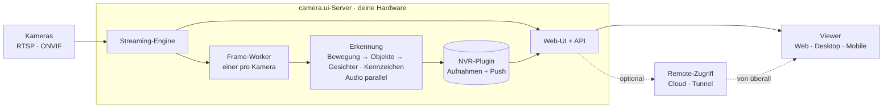

# Wie es funktioniert

camera.ui ist **server-zentral**: Ein einzelner Server, der auf deiner Hardware läuft, erledigt die gesamte Arbeit. Er verbindet sich mit deinen Kameras, streamt und nimmt Video auf, führt die Erkennung aus und liefert die Oberfläche aus. Der Browser und die Mobile-Apps sind **Viewer** dieses Servers. Die Desktop-App kann ebenfalls Viewer sein oder selbst den Server betreiben.

## Ein in sich geschlossener Server

Der camera.ui-Server bringt alles mit, was er zum Laufen braucht: die Weboberfläche, eine eingebaute **Streaming-Engine** (unser eigener go2rtc-Build) für Live-Video und eine eigene **Video-Verarbeitung** zum Dekodieren und Aufnehmen. Deine Einstellungen, Kameras, Benutzer und Ereignisse liegen in einer kleinen **lokalen Datenbank** auf derselben Maschine.

Nichts verlässt dein Netzwerk, solange du nicht den [Remote-Zugriff](/de/remote/) aktivierst. Es gibt keine externe Datenbank, und für den Betrieb eines Servers ist kein Cloud-Account nötig.

## Das große Ganze

```mermaid
flowchart LR
  cam[Kameras<br/>RTSP · ONVIF]

  subgraph server[camera.ui-Server · deine Hardware]
    direction TB
    g[Streaming-Engine] --> fw[Frame-Worker<br/>einer pro Kamera]
    fw --> det[Erkennung<br/>Bewegung → Objekte → Gesichter · Kennzeichen<br/>Audio parallel]
    det --> nvr[(NVR-Plugin<br/>Aufnahmen + Push)]
    g --> api[Web-UI + API]
    nvr --> api
  end

  cam --> g
  api --> viewers[Viewer<br/>Web · Desktop · Mobile]
  api -. optional .-> remote[Remote-Zugriff<br/>Cloud · Tunnel]
  remote -. von überall .-> viewers
```

## Von der Kamera zur Benachrichtigung

1. **Streaming.** Die Streaming-Engine verbindet sich mit jeder Kamera und wandelt deren Feed in browserfreundliches Live-Video um (WebRTC und MSE). Streams werden „warm" gehalten, damit Live-Ansicht und Snapshots sofort laden.
2. **Analyse pro Kamera.** Jede Kamera bekommt ihren eigenen **Frame-Worker**, einen Hintergrundprozess, der das Video dekodiert und die Erkennung ausführt. Ein Problem bei einer Kamera beeinträchtigt die anderen nicht.
3. **Gestufte Erkennung.** Zuerst läuft die günstige Bewegungserkennung und weckt die schwerere KI nur bei Bewegung: Objekterkennung, dann Gesichter, Kennzeichen, Klassifizierung und semantische (CLIP-)Analyse. Audio wird parallel analysiert. Diese „Kaskade" hält CPU- und GPU-Last niedrig.[^detect]
4. **Ereignisse & Aufnahme.** Wenn die Erkennung auslöst, baut der Server ein **Ereignis** mit Segmenten, Thumbnails und den gefundenen Objekten, Gesichtern oder Kennzeichen. Das **NVR-Plugin** nimmt das Material auf, speichert es und liefert es für die Wiedergabe zurück.[^license]
5. **Benachrichtigungen.** Ereignisse können Push-Benachrichtigungen auslösen und [Automationen](/de/automations/) ausführen.[^license]

## Plugins machen es erweiterbar

Vieles an camera.ui kommt über **Plugins** aus dem In-App-Store. Jedes Plugin läuft in einem eigenen Prozess, ein fehlerhaftes Plugin legt den Server also nicht lahm, und nach einem Absturz startet es automatisch neu.

Plugins liefern:

- **Kamera-Quellen.** ONVIF und weitere Kamera-Protokolle.
- **Detektoren.** Bewegungs-Engines und die KI-Backends (CoreML, ONNX, OpenVINO, NCNN, Coral, Hailo).
- **Aufnahme & Benachrichtigungen.** Das NVR-Plugin nimmt dein Material auf und sendet Push-Benachrichtigungen.
- **Smart-Home-Bridges.** Apple HomeKit.

Mehr dazu unter [Plugins](/de/plugins/).

## Apps: Desktop, Mobile, Web

Alle Apps zeigen dieselbe Oberfläche, aber ihre Rollen unterscheiden sich:

- Die **[Desktop-App](/de/install/desktop)** kann der **Server selbst** sein (All-in-One), ein **Viewer**, der sich mit einem anderen Server verbindet, oder ein **Worker**, der einen anderen Server beim Dekodieren, bei der Erkennung oder mit einem Plugin unterstützt. Du wählst das beim ersten Start und kannst jederzeit wechseln. Siehe [Über mehrere Maschinen skalieren](#uber-mehrere-maschinen-skalieren).
- Die **[Mobile-Apps](/de/install/mobile)** und der **Browser** sind immer **Viewer**.

Wie Viewer den Server erreichen:

- In deinem Netzwerk verbinden sich Browser und ein Desktop-Viewer **direkt**.
- Die **Mobile-Apps** verbinden sich zu Hause direkt über dein lokales Netzwerk und unterwegs über **camera.ui Cloud**.[^cloud-optional]
- Ein Browser außerhalb von zuhause nutzt die [Remote-Zugriff-Option](/de/remote/), die du eingerichtet hast: camera.ui Cloud, einen Cloudflare-Tunnel oder deine eigene Domain.

Du kannst außerdem mehr als einen Server als **Instanz** speichern und in derselben App zwischen ihnen wechseln.

## Über mehrere Maschinen skalieren

Zusätzliche Maschinen können als **Worker** mitarbeiten. Ein Worker übernimmt Dekodieren und Erkennung für einige Kameras oder führt ein ganzes Plugin aus (für einen Detektor, der Hardware braucht, die dem Hauptserver fehlt). Kameras und Plugins eines Workers fallen **zurück** auf den Hauptserver, solange der Worker offline ist, und wandern zurück, sobald er sich wieder verbindet. Siehe [Worker](/de/admin/workers).

## Von außen erreichen

Von außerhalb deines Netzwerks nutzt du camera.ui Cloud, einen Cloudflare-Tunnel, eine eigene Domain oder Port-Forwarding. Alles davon ist optional. Siehe [Remote-Zugriff](/de/remote/).

[^detect]: Erkennung benötigt ein Detection-Plugin, das zu deiner Hardware passt (CoreML, ONNX, OpenVINO, NCNN oder einen Edge-Beschleuniger wie Coral oder Hailo). Siehe [Erkennung & KI](/de/detection/).
[^license]: Ein aktives camera.ui-Abo deckt Aufnahmen (NVR) und die darauf aufbauenden Funktionen ab, etwa Wiedergabe, Export, Gesichtserkennung, semantische Suche und KI-Beschreibungen, dazu Push-Benachrichtigungen. Live-Ansicht und Echtzeit-Erkennung sind kostenlos.
[^cloud-optional]: camera.ui Cloud ist optional. In deinem eigenen Netzwerk bleibt alles lokal, und dein Server muss sich nie mit der Cloud verbinden. Siehe [Von außen erreichen](#von-außen-erreichen).
