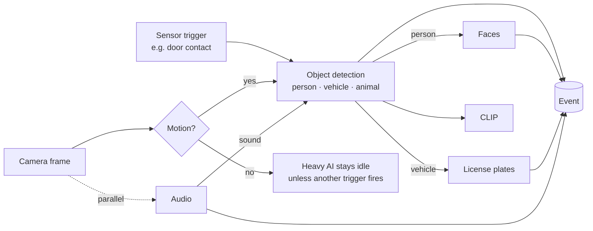

# Detection & AI

Detection is how camera.ui understands what's in your video: movement, people and vehicles, faces, license plates, and sounds. It runs on your own hardware, and the results become events you can browse, get notified about, and search.

## How detection works

Detection is layered, so it stays efficient:

1. **Motion** runs continuously and cheaply. It just notices that something changed.
2. When a trigger fires, the heavier **AI** wakes up. It runs object detection (people, vehicles, animals), then looks closer at what it found: faces on the people it sees, license plates on the vehicles, and a semantic fingerprint for search. Motion is the usual trigger. A detected sound wakes the AI too, and so can another sensor, for example a door contact.

This "cascade" means the demanding AI only runs when there's something to look at, and each step only runs on the objects it applies to, which keeps CPU and GPU use low.

## What you can detect

- **[Motion](/detection/motion)** — movement in the frame.
- **[Objects](/detection/ai-backends)** — people, vehicles, and animals.
- **[Faces](/detection/faces)** — recognise known people and group unknown ones.
- **[License plates](/detection/license-plates)** — read plate numbers.
- **[Audio](/detection/audio)** — sounds like glass breaking, alarms, or a dog barking.
- **[Semantic search](/detection/semantic-search)** — find moments by describing them in words.
- **[AI descriptions](/detection/genai-descriptions)** — a written summary of what happened.

## Plugins do the work

Detection is provided by [plugins](/plugins/) you enable per camera: a **motion engine** and an **AI backend** that matches your hardware. You choose and tune them in a camera's [settings](/cameras/settings). See [Set up sensors](/sensors/setup) for how to enable them.

Each detection becomes part of an **event**. See [Events & detections](/detection/events-and-detections) for how those are structured, and [Recording (NVR)](/recording/) for browsing them.
