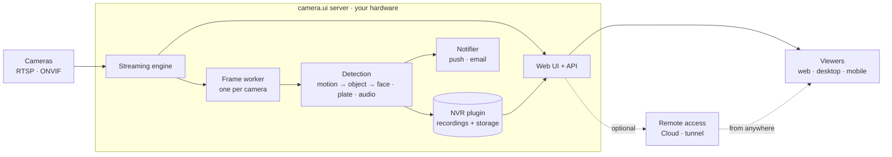

# How it works

camera.ui is **server-centric**: one server, running on your hardware, does all the work. It connects to your cameras, streams and records video, runs detection, and serves the interface. The browser and the mobile apps are **viewers** of that server. The desktop app can be a viewer too, or run the server itself.

You don't need to understand the internals to use camera.ui, but a quick mental model makes the rest of these docs easier to follow.

## One self-contained server

The camera.ui server bundles everything it needs to run: the web interface, a built-in **streaming engine** (our own go2rtc build) for live video, and its own **video processing** for decoding and recording. Your settings, cameras, users, and events live in a small **local database** on the same machine.

Nothing leaves your network unless you turn on [remote access](/remote/). There is no external database, and no cloud account is required to run a server.

## The big picture

## From camera to notification

Here is what happens behind a single detection:

1. **Streaming.** The streaming engine connects to each camera and turns its feed into browser-friendly live video (WebRTC and MSE). Streams are kept "warm" so live view and snapshots load instantly.
2. **Per-camera analysis.** Every camera gets its own **frame worker**, a dedicated background process that decodes the video and runs detection. Because each camera runs on its own, a problem with one never affects the others.
3. **Layered detection.** Cheap motion detection runs first. Only when it sees movement does it wake the heavier AI: object detection, then faces, license plates, classification, and semantic (CLIP) analysis. Audio is analyzed in parallel. This "cascade" keeps CPU and GPU use low.[^detect]
4. **Events & recording.** When detection fires, the server builds an **event** with segments, thumbnails, and the objects, faces, or plates it found. The **NVR plugin** records the footage, stores it, and serves it back for playback.[^license]
5. **Notifications.** Events can trigger push notifications and run [automations](/automations/).[^license]

## Plugins make it extensible

A lot of what camera.ui does is delivered by **plugins**, add-ons you install from an in-app store. Each plugin runs in its own isolated process, so a misbehaving plugin can't take down the server, and it restarts automatically if it crashes.

Plugins provide:

- **Camera sources.** ONVIF and other camera protocols.
- **Detectors.** Motion engines and the AI backends (CoreML, ONNX, OpenVINO, NCNN, Coral, Hailo).
- **Notifications.** The notifier.
- **Smart-home bridges.** Apple HomeKit.

Learn more under [Plugins](/plugins/).

## Apps: desktop, mobile, web

You use camera.ui through the same interface everywhere, but the apps don't all play the same role:

- The **[desktop app](/install/desktop)** can be the **server itself** (running camera.ui on your machine, the simplest all-in-one setup), or a **viewer** that connects to another server. You choose on first launch, and can switch anytime.
- The **[mobile apps](/install/mobile)** and the **browser** are always **viewers**.

How viewers reach the server:

- On your network, the browser and a desktop viewer connect **directly**.
- The mobile apps, and any browser away from home, connect through **camera.ui Cloud**.[^cloud-optional]

You can also save more than one server as an **Instance** and switch between them from the same app.

## Scaling across machines

For larger setups, you can add extra machines as **workers**. A worker takes over the decoding and detection for some cameras, offloading the main server, or it can run an entire plugin instead (useful for a detector that needs specific hardware the main server lacks). Cameras and plugins assigned to a worker automatically **fall back** to the main server if that worker goes offline, and move back to the worker once it reconnects. See [Instances & workers](/admin/instances-workers).

## Reaching it from outside

On your local network you connect directly. To reach your server from anywhere, camera.ui offers several options: camera.ui Cloud, Cloudflare tunnels, a custom domain, or direct port-forwarding. All of them are optional and entirely your choice. See [Remote access](/remote/).

[^detect]: Detection needs a detection plugin that matches your hardware (CoreML, ONNX, OpenVINO, NCNN, or an edge accelerator like Coral or Hailo). See [Detection & AI](/detection/).
[^license]: An active camera.ui subscription covers recording (NVR) and the features built on it, such as playback, export, face recognition, semantic search, and AI descriptions, plus push notifications. Live view and real-time detection are free.
[^cloud-optional]: camera.ui Cloud is optional. On your own network everything stays local, and your server never has to connect to the cloud. See [Reaching it from outside](#reaching-it-from-outside).
